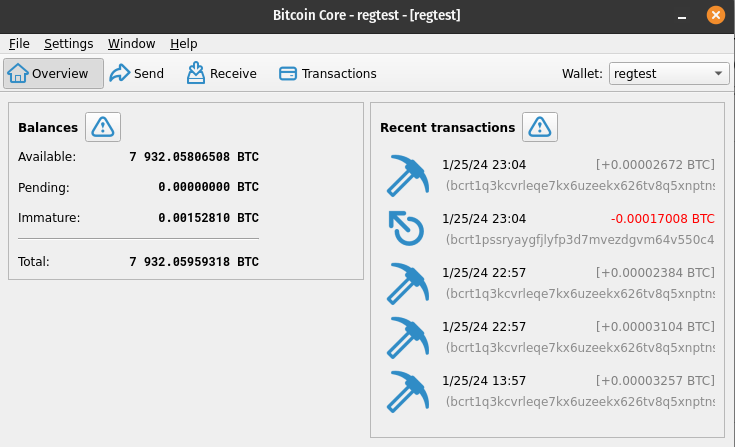

# Building on Bitcoin Core

</br>

<p class="center">
  By Topher Scott
</p>

<p class="center">
  https://t.ly/JimmS
</p>

---

<!-- class: _invert -->

# What is Bitcoin Core?

* The original client created by Satoshi Nakamoto. Written in C++.

* The most dominant node implementation in the ecosystem.

* Light, portable binary with few dependencies.

* A basic GUI client wallet, with a developer console.

<!-- 
  * Do we have a visual breakdown of clients in the space?

  * Gold standard for on-chain disputes, peering, and mempool policy.
-->

---

# Installing Bitcoin Core

* Download Bitcoin Core
  https://bitcoin.org/en/download

* Installation Guide
  https://bitcoin.org/en/full-node

* Build from Source
  https://github.com/bitcoin/bitcoin


---

# Configuring Bitcoin Core

* Using the command line:
  `bitcoin-qt -regtest`

* Using a `bitcoin.conf` config file:
  ```conf
  ## Bitcoin Config
  chain   = regtest
  server  = 1
  txindex = 1
  ```

<i>https://jlopp.github.io/bitcoin-core-config-generator</i>


---

# Choosing a Network (blockchain)

* **regtest** : Internal testing. Can generate blocks freely.

* **signet**  : Public / feature testing. Can host your own chain.

* **testnet** : Staging / final testing. Follows main consensus code.

* **main**    : The main chain that we all know and love.

* **mutiny**  : Custom signet fork. Allows faster issuance of blocks.

---

# Bitcoin QT Demo

* Launch the client: `bitcoin-qt -regtest`

* Create a new wallet and generate an address.

* Use the node console to generate blocks.

* Use our wallet to send / receive funds.

* View our transaction on the blockchain.



---

# Bitcoin Core Daemon

* Run in the foreground:
  ```bash
  bitcoind -regtest
  ```

* Run in the backround:
  ```bash
  bitcoind -daemon -regtest
  tail -f ~/.bitcoin/regtest/debug.log
  ```

* Run as a system service:
  https://github.com/bitcoin/bitcoin/blob/master/contrib/init/bitcoind.service

---

# Indexing Block Data

* Bitcoin Core has limited indexing options.
  `txindex=1`

* Electrs offers an expanded index of chain data.

* Examples of live indexing servers:
  - https://mempool.space
  - https://github.com/Blockstream/esplora

* Indexes can get very large (600+GB).

* You can mock up your own indexer for local testing.


---

# Connecting to Bitcoin Core (CLI)

* Generate RPC Auth String:
  https://jlopp.github.io/bitcoin-core-rpc-auth-generator

* Add to `bitcoin.conf` file:
  `rpcauth=regtest:84778e451d9eda98f9ea0c7bf6245e5e$ef8626caf617f9be75c5ad636f92e97aa85caa40cef578beb0147a9cdf158ee2`

* Connecting to Bitcoin Core (CLI)

  ```bash
  alias bcli="bitcoin-cli -rpcuser=regtest -rpcpassword=bitcoin -rpcwallet=regtest"
  bcli getnewaddress
  ```

<i>https://developer.bitcoin.org/reference/rpc</i>

---

# Connecting to Bitcoin Core (JSON-RPC)

```js
{
  url     : 'http://127.0.0.1:18443/wallet/<wallet_name>',
  method  : 'POST',
  headers : {
    'Authorization' : 'Basic ' + base64('user' + ':' + 'pass'),
    'content-type'  : 'application/json'
  },
  body : JSON.stringify({
    jsonprc : 1.0,
    id      : randomId(),
    method  : 'getnewaddress',
    params  : [ '-addresstype', 'legacy' ]
  })
}
```

<i>https://github.com/bitcoin/bitcoin/blob/master/doc/JSON-RPC-interface.md</i>

---

# Wrapping Bitcoin Core

* Use JSON-RPC to fetch and return a response.

* Wrap the JSON-RPC call with an http endpoint.

* View the endpoint in the browser.

<i>https://github.com/cmdruid/core-cmd</i>


---

<!-- class: invert -->

# Go out and build!

</br>

* Contract Info:
  github.com/cmdruid
  twitter/x: @btctechsupport

</br>

* Link to presentation:
  https://t.ly/JimmS

