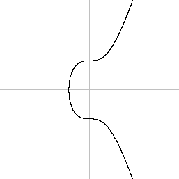
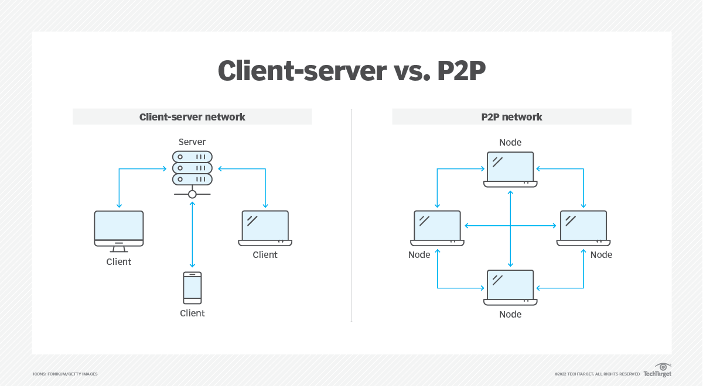

<div style="padding-top:200px;">
  <h1>FROST Workshop</h1>
  <p>by Christopher Scott</p>
  
  <p style="height:210px;"></p>
  <a href="https://github.com/cmdruid/workshops">https://github.com/cmdruid/workshops</a>
</div>

---

# What is FROST?

* Fast Round-Optimized Schnorr Signatures with Threshold.

* Published in December, 2020 by Chelsea Komlo and Iam Goldberg.

* Builds on top of the Shamir Secret Sharing (SSS) and Pederson Distributed Key Generation (DKG) protocols.

* Use secret shares to sign a message as a group, without revealing the group secret or your share to others.

<!--
  * Both authors are from University of Waterloo in Ontario, Canada.

  * Chelsea works for Zcash foundation.

  * They published a draft specification through IETF and paid for independent audits of the protocol.
-->

---

# What can we do with FROST?

* We can publish a signed message using **k** of **n** signatures.

* Control magic internet money using a quorum of **k** of **n** participants.

* Keep the identity of all signing participants private.

---

# Hidden Benefits of FROST

* Should work with any schnorr-based digital signature protocol.

* The FROST secret key can be provably unknowable (via DKG).

* The **k** of **n** terms of a FROST pubkey can be updated by **k** particpants.

* The terms can be updated without changing the pubkey or secret.

---

# FROST Crash Course

* Polynomials and Interpolation.

* Shamir Secret Sharing.

* Distributed Key Generation (DKG).

* Attacks and vulnerabilities.

* FROST signature protocol.

---

# What is a Polynomial?

* Expresses a sum of terms for one or more variables and coefficients:

  **P(x) = 3x$^{2}$ + 2x + 1**

* Terms can be combined using addition, subtraction, and multiplication.

* The relationship between **P(x)** and **x** can be plotted on a graph:

   **P(x)$^{2}$ = x$^{3}$ + 7** 

<!--
* Polynomials can range from being very simple, to very complex.

* Polynomials describe the relationship between variables by expressing one as a function of the other, using a sum of powers with coefficients.

* The secp256k1 curve is visible when modeled over a small range of real numbers (ex: -8 ~ 8+).
-->

---

# Polynomial Interpolation

* Creates a polynomial based on a set of data points.

* Evaluating **P(x)** will create new  points in relation to the existing set.

* The preferred method we use is called Lagrange Interpolation.

  **P(x) = y$_{0}$L$_{0}$(x) + y$_{1}$L$_{1}$(x) + ... + y$_{i}$L$_{i}$(x)**


<!--
  * New data points will follow the "curve" that passes through the existing set of points.

  * This is only part of the formula. Not pictured is the Basis Polynomials (L).
-->

---

# Shamir Secret Shares

* Create the following polynomial of degree (**t - 1**) with constant term **S**:

  **P1(x) = **S** + a1x + a2x$^{2}$ + ... + a$_{t-1}$x$^{t-1}$**

* For each **P1(x)** we evaluate, we receive a new point (called a "share").

* Using **t** number of shares, we create a second polynomial via interpolation.

  **P2(x) = y$_{1}$L$_{1}$(x) + y$_{2}$L$_{2}$(x) + ... + y$_{t}$L$_{t}$(x)**

* If we evaluate at **P2(0)**, we will return the constant **S**.

---

# Why use Shamir Secret Shares?

* We can imbue a secret **S** to have a desired threshold of **t**.

* We can then split **S** into *any* number of individual shares.

* We can recover **S** using any subset of shares, provided we have **t** shares.

---

# Limitations of Shamir Secret Sharing

* Because **t** shares will reveal **S**, each share must be kept secret.

* Shamir assumes one person will generate all shares.

* We need a polynomial that is shared by a group of adversaries.

* How do we create a group polynomial where nobody knows **S**?

---

# Distributed Key Generation

For each participant :

* Create a polynomial with random **S** and threshold **t**.

* Deliver share **P(x)** to every participant **x** (including you).

* Sum all participant shares (including yours) into share **gx**.

* Share **gx** is a part of unknown group polynomial **gP(x)**.

Participants must collect **t** shares to create **gP**, which contains **gP(0) = gS**.

<!--
* Using DKG, we have the basis for a multi-signature protocol with a threshold.
-->

---

# Attacks on Schnorr Multi-Signatures

* Subset sum attack.

* Chosen message attack.

* Wagner's Algorithm.

* ROS Attack.

<!--

There is a popular concept in probability theory called the birthday paradox:

In a small group of people, and with 365 days in a year, there is a high likelihood that two people share the same birthday.

25 people : 56%
30 people : 70%
50 people : 97%

The birthday paradox highlights the likelihood that two random elements in a set are equal.

A subset sum attack searches through a set of numbers for a subset of numbers that sum to a target value.

This attack can be used to manipulate a signature or set of signatures, and produce a forged signature.

A chosen message attack is used to manipulate a cryptographic protocol so that it reduces to a subset sum problem.

In 2002, Wagner's algorithm was introduced by David Wagner. It's designed to solve certain subset sum problems very efficiently. This made a lot of cryptographers nervous.

In 2019, Roel Drijvers demonstrated the vulnerability of certain Schnorr-based multi-signature schemes to Wagner's algorithm.

In 2020, Fabrice Benhamouda demonstrated another attack that could be used to parallelize the wagner algorithm and forge digital signatures in a matter of minutes.

The paper is nick-named "the ROS paper", which stands for Random inhomogeneities in a Overdetermined Solvable system of linear equations.

These attacks broke a lot of security assumptions surrounding DKG and multi-signature protocols.
-->

---

# The FROST Protocol

FROST defines a secure and efficient protocol for signing a message using schnorr and secret shares.

For each participant:

* Step 1: Create and distribute public nonce values (Round 1).

* Step 2: Collect other nonces, compute the group nonce and challenge.

* Step 3: Sign challenge with your share + secret nonce values.

* Step 4: Distribute, collect and verify partial signatures (Round 2).

Finally, combine **t** partial signatures into a complete schnorr signature.

---

# Round 1: Enrollment

* Generate two nonce values: "hidden" nonce and "binding" nonce.

* All participants exchange public nonces with each other.

* Also a good time to exchange shares and commits for DKG.



<!--
* The "nonce" value is a one-time secret that you generate when signing a message.

* The nonce "masks" your secret and protects it from being revealed.

* The binding nonce will be tweaked with a group commitment.

* The hidden nonce will remain unchanged by the protocol.

* Round 1 is the most intensive for communication.

* P2P: Imagine a room where everyone must shake the hand of everyone else at least once.

* Client-server: Imagine a room where everyone must shake the hand of one special person.
-->

---

# Computing the Group Nonce for a Signature

* Generate a list of ids (**x**) and public nonces from each participant.

* Concatenate all participant data and hash it (using sha256).

* Concatenate this hash with the group pubkey and message being signed, then hash again. This is the group "prefix".

* For each participant, concatenate their id (**x**) with the prefix, then hash it. This is the participant's "binding factor".

* Tweak the participant's binding nonce value with the binding factor. Then add the tweaked nonce to the hidden nonce.

* Combine all particiant nonces into the group nonce **R**.

---

# Computing the Group Nonce for a Signature

```py
# Generate a list of concatenated data from each participant.
commits = [ concat(p.x, p.h_pnonce, p.b_pnonce) for p in participants ]

# Reduce all commitments into a single hash.
c_hash = sha256(...commits)

# Compute the group prefix hash.
prefix  = sha256(group_pk, message, c_hash)

# Compute the binders for each participant.
binders = [ sha256(prefix, p.x) for p in participants ]

# Compute the group nonce value.
group_R = 0
for p in participants:
  group_R += p.h_pnonce
  group_R += (p.b_pnonce + binders[p.x])
```

<!--
* This is a gross over-simplification of the protocol. Read the actual IETF specification for more accurate code.

* The prefix is meant to commit to the data of all participants involved the signing session.

* Each participant receives a unique commitment hash, which includes the group prefix hash + their share's x value.

* It's okay if your brain "tunes-out" on this slide.
-->

---

# Why are we doing this?

* The nonce value is the most vulnerable part of a digital signature. It sits between your private key and the world.

* Allowing influence over this nonce is very dangerous. Nonce manipulation is the basis of many different types attacks.

* The group nonce value must *not* be gameable by any participant in the group, in any sort of way.

<!--
* Creating the group nonce for a signature is really the meat and potatoes of FROST.
-->
 
---

# Creating a Partial Signature

* Taproot: We have to negate our nonce values if the group nonce has an odd y-value.

* Taproot: We also have to calculate the parity and accumulative parity of the group public key when tweaks are applied.

* Taproot: Compute the challenge using BIP340.

* Compute **x** coefficient for the participant's secret share.

* Compute the participant's secret nonce.

* Compute the final signature.

---

# Creating a Partial Signature

```py
# Taproot: Negate nonces if needed.
if group_R.y % 2 !== 0:
  h_snonce = N - h_snonce
  b_snonce = N - b_snonce

# Taproot: Set the correct parity for the secret key (BIP327).
sk = group_Q.parity * group_Q.state * share_secret

# Taproot: Format challenge using BIP340.
e = hash340('BIP340/challenge', message, share_pubkey, group_R)

# Compute participant coefficient from x values.
c = interpolate(identifiers, share_x)

# Compute the participant's secret nonce.
k = (b_snonce * bind_factor) + h_snonce

# Compute the participant's partial signature.
psig = (sk * e * c) + k
```

---

# Combining Partial Signatures

* If **t** partial signatures are combined, the result is a valid schnorr signature.

* Any tweaks to the group pubkey must also be applied to the signature.

```py
# Taproot: Compute the proper tweak value.
T = challenge * group_Q.parity * tweak

# Sum partial signature values, plus tweak.
s = ps_1 + ps_2 + ... + ps_t + T

# Return the final schnorr signature.
signature = concat(R, s)
```

---

# Protocol Misbehavior

* Participant share contributions must be verified (using VSS).

* Partial signatures must be verified.

* FROST trades robustness for efficiency.

* ROAST offers a more robust version of FROST.

---

# FROST Demo

---

# BONUS: Updating shares of a Group Secret

* Set of **t + 1** participants create a new polynomial where **P(0) = 0**.

* Each participant delivers shares of their polynomial using DKG.

* Each participant computes group share **gy**, then sums **gx + gy = gz**

* Because **gPY(0) = 0**, **gPZ(0) = gS**. The group constant does not change.

Based on how **gPY** is constructed, you can add / remove participants, replace shares, change the threshold, and more!

---

<div style="padding-top:200px;">
  <h1>The End</h1>
  
  <p style="height:210px;"></p>
  <a href="https://github.com/cmdruid/workshops">https://github.com/cmdruid/workshops</a>
</div>