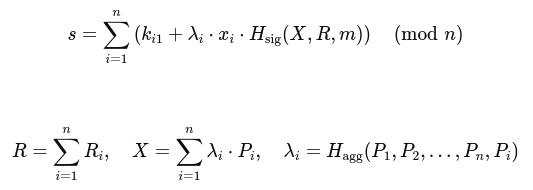

# The Multi-Verse of Multi-Sig

A brief overview of multi-signature protocols for Bitcoin.

</br></br>


---

## Overview

* Crash-course in bitcoin and digital signatures.
* Types of muli-sig protocols.
* Examples of multi-sig scripts.
* How to perform a multi-sig.
* Caveats to using multi-sig.
* ~~Live Demo~~

<!--
  * This is a new presentation and still kind of rough.
  * Don't expect supertestnet levels of rizz in this presentation.
  * He likes to throw in colors and graphics, and anime girls.
  * I didn't have time to add those things, 
    but I hid an anime girl in this presentation.
-->

---

## Spooky Language

* Multi-Signature protocol.
* Key Derivation Paths.
* Off-Chain State Management.

---

## How Bitcoin Works

* Transactions spend and move coins to new pubkeys.
* Digital signatures authorize the spending of coins.
* Miners batch transactions together into a "block".
* Miners perform "work" on the block and submit to the network.
* Mined blocks enforce the order and finality of transactions.

---

## What is a Digital Signature?

* A zero-knoweldge proof of knowing a secret key.

</br></br>

```
G            = Generator Point
public_key   = secret_key   * G
public_nonce = secret_nonce * G

sign   : (secret_key * message) + secret_nonce = signature
verify : (public_key * message) + public_nonce = signature * G
```

<!--
  * Imagine having a pen that creates magic ink.
  * The pen creates this magic ink using a public formula,
    but mixes in a secret ingredient.
  * If you sign something with your magic pen, others can inspect
    the ink and formula to see that came from your pen.
  * But inspecting the ink doesn't reveal the secret ingredient.

  UNLIKE a traditional signature, where inspecting the signature
  allows you to create a forgery.
-->

---

## What is a Multi-Signature?

</br></br>

* Same as a single signature, but with more signatures.
* N-of-N: Everybody involved must sign.
* M-of-N: Only some people need to sign.

<!--
  *
  *
  *
-->

---

## Types of Multi-Signatures

</br>

* Scripted multi-sig:
  `Legacy`: Output script using `OP_CHECKMULTISIG`.
  `Segwit`: Witness script using `OP_CHECKMULTISIG`.
  `Taproot`: Witness script using `OP_CHECKSIGADD`.

</br>

* Script-less multi-sig.
  `[N-of-N]`: Musig2.
  `[M-of-N]`: FROST.

<!--
  *
  *
  *
-->

---

## Multi-Sig Script Examples (decoded) 

* `[ OP_2, <PUBKEY_A>, <PUBKEY_B>, <PUBKEY_C>, OP_3, OP_CHECKMULTISIG ]`

* `[ <PUBKEY_A>, OP_CHECKSIGVERIFY, <PUBKEY_B>, OP_CHECKSIG ]`

* `[ OP_0, <PUBKEY_A>, OP_CHECKSIGADD <PUBKEY_B>, OP_CHECKSIGADD, OP_2, OP_NUMEQUAL ]`

<!--
  *
-->

---

## Multi-Sig Script Examples (encoded)

* `bc1qgzp5pmkse8c02uqtfrue390r5p8h45hw4matedrryr8rxwmwjvsst9j7cu`

* `bc1qmy5t4q74mg9xerc9yy72cn2yc5tlhu4augd64trdv8ysz0yyg3sqx04zth`

* `bc1pl5g3hvspykt6pacpa7vyjt04xjxqwfwja9yuh634s4p8lqx3dmqq4mpj8n`

<!--
  *
  *
-->

## Complex Multi-Sig Script Example (Lightning)

```
OP_IF
    OP_SHA256 <PAYMENT_HASH> OP_EQUALVERIFY
    <PUBKEY_B> OP_CHECKSIG
OP_ELSE
    <CLTV_TIMEOUT> OP_CHECKLOCKTIMEVERIFY OP_DROP
    <PUBKEY_A> OP_CHECKSIG
OP_ENDIF
```

---

## Script-less Multi-Sig Examples

</br></br>



</br></br>

---

## Creating a Multi-Sig

* Agree on members and public keys.

* Create the locking script.

* Encode the script as a bitcoin address.

* Send money to the bitcoin address.

<!--
  * You can send to a multi-sig address from any bitcoin wallet.
  *
  *
-->

---

## Spending From a Multi-Sig

* Agree on members and what to sign.

* Agree on a coordinator (or talk to everyone).

* Collect (enough) signatures from other members.

* Create a transaction with the coins, signatures, and script.

<!--
  We typically use PSBTs for this, which stands for
  partially signed bitcoin transactions.
  PSBTs are a format that is designed to handle the extra stuff
  needed for coordinating a transaction between people.
  but they are optional, you can coordinate however you like.
-->

---

## Partially Signed Bitcoin Transaction (PSBT)

</br></br>

```
cHNidP8BAFUCAAAAASeaIyOl37UfxF8iD6WLD8E+HjNCeSqF1+Ns1jM7XLw5AAAAAAD
/////AaBa6gsAAAAAGXapFP/pwAYQl8w7Y28ssEYPpPxCfStFiKwAAAAAAAEBIJVe6g
sAAAAAF6kUY0UgD2jRieGtwN8cTRbqjxTA2+uHIgIDsTQcy6doO2r08SOM1ul+cWfVa
frEfx5I1HVBhENVvUZGMEMCIAQktY7/qqaU4VWepck7v9SokGQiQFXN8HC2dxRpRC0H
Ah9cjrD+plFtYLisszrWTt5g6Hhb+zqpS5m9+GFR25qaAQEEIgAgdx/RitRZZm3Unz1
WTj28QvTIR3TjYK2haBao7UiNVoEBBUdSIQOxNBzLp2g7avTxI4zW6X5xZ9Vp+sR/Hk
jUdUGEQ1W9RiED3lXR4drIBeP4pYwfv5uUwC89uq/hJ/78pJlfJvggg71SriIGA7E0H
MunaDtq9PEjjNbpfnFn1Wn6xH8eSNR1QYRDVb1GELSmumcAAACAAAAAgAQAAIAiBgPe
VdHh2sgF4/iljB+/m5TALz26r+En/vykmV8m+CCDvRC0prpnAAAAgAAAAIAFAACAAAA=
```

<!--
cHNidP8BAFUCAAAAASeaIyOl37UfxF8iD6WLD8E+HjNCeSqF1+Ns1jM7XLw5AAAAAAD/////AaBa6gsAAAAAGXapFP/pwAYQl8w7Y28ssEYPpPxCfStFiKwAAAAAAAEBIJVe6gsAAAAAF6kUY0UgD2jRieGtwN8cTRbqjxTA2+uHIgIDsTQcy6doO2r08SOM1ul+cWfVafrEfx5I1HVBhENVvUZGMEMCIAQktY7/qqaU4VWepck7v9SokGQiQFXN8HC2dxRpRC0HAh9cjrD+plFtYLisszrWTt5g6Hhb+zqpS5m9+GFR25qaAQEEIgAgdx/RitRZZm3Unz1WTj28QvTIR3TjYK2haBao7UiNVoEBBUdSIQOxNBzLp2g7avTxI4zW6X5xZ9Vp+sR/HkjUdUGEQ1W9RiED3lXR4drIBeP4pYwfv5uUwC89uq/hJ/78pJlfJvggg71SriIGA7E0HMunaDtq9PEjjNbpfnFn1Wn6xH8eSNR1QYRDVb1GELSmumcAAACAAAAAgAQAAIAiBgPeVdHh2sgF4/iljB+/m5TALz26r+En/vykmV8m+CCDvRC0prpnAAAAgAAAAIAFAACAAAA=
-->

---

## Key Derivation

Example: `"m/86'/1'/0'/0/1"`

Decoded:
  * Start with master key.
  * Derive new key using value `86 ^ 0x80000000`. (version)
  * Derive new key using value `1  ^ 0x80000000`. (network)
  * Derive new key using value `0  ^ 0x80000000`. (account)
  * Derive new key using value `0`.               (sub acct)
  * Derive new key using value `1`.               (index)

<!-- 
  Key derivation allows you to "extend" a single key in order to create many keys.
  These additional keys are derived using you "master" key, plus a "derivation path".
  These paths can be quite spooky to look at, and full of technical debt:
  Example of a derivation path: "m/86'/1'/0'/0/1"
-->

---

## Off-Chain State

Hash   : `408340eed0c9f0f5700b48f99895e3a04f7ad2eeaefabcb46320ce333b6e9321`

Script :
```
[
  'OP_2',
  '039997a497d964fc1a62885b05a51166a65a90df00492c8d7cf61d6accf54803be',
  '024edfcf9dfe6c0b5c83d1ab3f78d1b39a46ebac6798e08e19761f5ed89ec83c10',
  '029094567ba7245794198952f68e5723ac5866ad2f67dd97223db40e14c15b092e',
  'OP_3',
  'OP_CHECKMULTISIG'
]
```

*The hash is stored on-chain, **not** the script!*

<!--
  Not all multi-sig solutions are equal!
  Most solutions require that you have more knowledge than just your own key!
  This additional data must be stored and backed-up along with your key, or your funds can become unrecoverable.
-->

---

## Why Use Multi-Sig?

  * For your own protection:
    `[2/3]` Laptop / Phone / Backup.

  * For managed backups and protection:
    `[2/3]` Wallet / Custodian / Backup.
  
  * For group protocols:
    `[2/2]` Alice & Bob (Lightning)
    `[2/3]` Alice, Bob & Bank (Escrow)
    `[11/15]` Multi-Sig Bridge (Liquid)

---

## Multi-Sig Wallets

* Bitcoin QT:
  https://bitcoincore.org/en/download

* Sparrow Wallet:
  https://sparrowwallet.com

* Electrum Wallet:
  https://electrum.org

<!--
  - Caravan / Trident
-->

---

### Resources

* https://github.com/cmdruid/workshops

### Socials

```
Github  : cmdruid
Nostr   : cmd@proof0.work
Twitter : @btctechsupport
```


---
